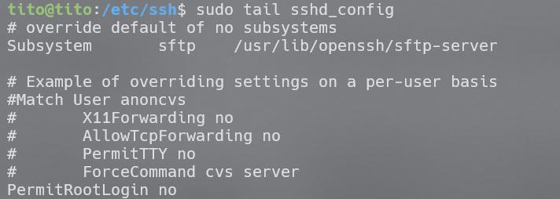
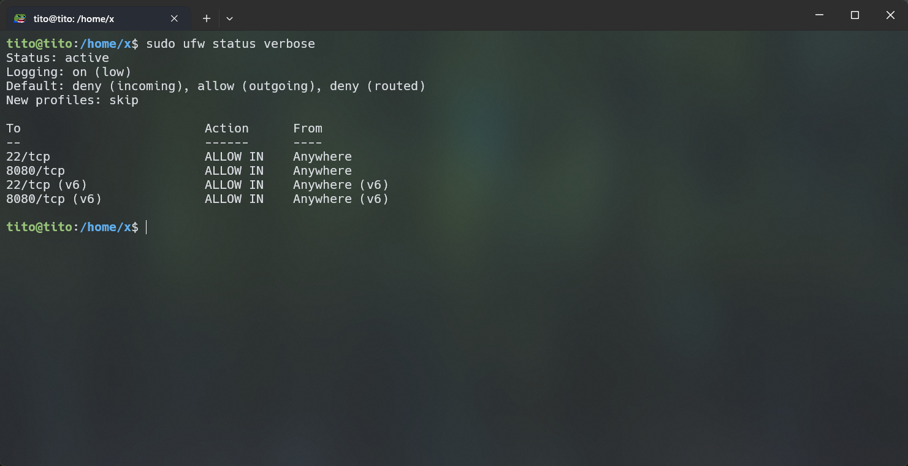
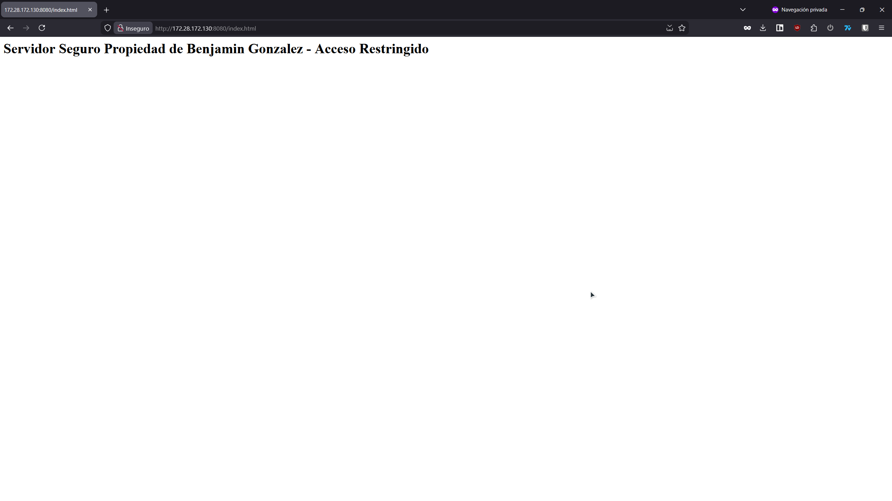

[](https://git.io/typing-svg)

## Inicio

> [!IMPORTANT]  
> **Scripts generados para sistemas que utilicen sistema de paquetes apt**
<br>
Primero es necesario clonar el repositorio

```bash
git clone https://github.com/Tito-blip/ExamenLinux.git
```

Luego ingresar a la carpeta

```bash
cd ExamenLinux
```
<br>

> [!CAUTION]
> Los scripts deben ser ejecutados en el orden en que se presentan a continuación, de lo contrario no funcionarán. 
<br>

## Script 1: Setup

Entrar a directorio deploy
```bash
cd deploy
```

Convertir a ejecutable

```bash
sudo chmod +x setup.sh
```

Ejecutar script

```bash
./setup.sh
```

Volver a directorio principal
```bash
cd ..
```

Después de ejecutar este script, se habrán instalado los siguientes paquetes:
- Docker
- Docker-compose
- Git
- Curl
- Ufw

Adicionalmente, se creará el directorio /opt/webapp/html, y el archivo index.html junto con la descarga del archivo docker-compose.yml (nginx).
También, creando un usuario sysadmin y grupo docker, así como un contenedor de nginx en docker.

<br>

## Script 2: Hardening

Entrar a directorio security
```bash
cd security
```

Convertir a ejecutable

```bash
sudo chmod +x hardening.sh
```

Ejecutar script

```bash
./hardening.sh
```

Volver a directorio principal
```bash
cd ..
```

Al terminar de ejecutar este script, el firewall UFW estará configurado para denegar conexiones entrantes, solo admitiendo conexiones a los puertos 22 y 8080.
Además, se deshabilita la opción para login root a través de ssh, y se cambian los permisos del archivo docker-compose.yml a 600.

<br>

## Script 3: Backup

Entrar a directorio maitenance
```bash
cd maitenance
```

Convertir a ejecutable

```bash
sudo chmod +x backup.sh
```

Ejecutar script

```bash
./backup.sh
```

Volver a directorio principal
```bash
cd ..
```

Con este script se ejecutará la comprensión del directorio /opt/webapp/html, copiándolo localmente con rsync al directorio /var/backups/webapp. 
Junto con esto, se entrega una funcionalidad teórica para copiar el archivo remotamente con scp.

<br>

## Justificación de Seguridad

Root Login: Dentro de una organización estructurada, siempre existirá un usuario con mayores privilegios (como alguien con acceso a sudo), pero aun así, nadie debería o necesitaría ingresar como root, ya que esto implica entregar permisos que ponen en riesgo la integridad del sistema. En caso de requerir privilegios superiores, siempre existirá la opción de utilizar su o sudo para un usuario administrador, sin tener que recurrir a una opción crítica a nivel del sistema operativo (menos aún si la conexión es a través de SSH).

Port Filter: Similar al punto anterior, la mayoría de conexiones al servidor van dirigidas a un puerto específico, siempre con un propósito establecido, ya sea conectar a una página web (80 o 443), SSH (22) o, en su defecto, conectar con un contenedor o servicio, los cuales tienen sus puertos definidos de antemano. Desde el punto de vista de la ciberseguridad, es muy sencillo realizar un escaneo de puertos a cualquier servidor en la red, quedando al descubierto para cualquier atacante en caso de no definir reglas claras. Con la sencillez y facilidad que ofrece el sistema Linux o derivados para manejar el firewall, no existe razón para no realizarlo en la gran mayoría de servidores existentes. Y aun así siguen existiendo empresas u organizaciones que no prestan atención a estos simples puntos, dando lugar a ataques fácilmente prevenibles. 

<br>

>**NOTE:** A pesar de no haber sido utilizado, los contenedores docker deberian ser creados sin privilegios, en este caso para ejecutar nginx, se podria crear como **container rootless**

## Screenshots

### SSH Config


### UFW Status


### Web Access


